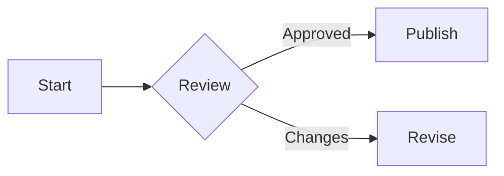

# Azure DevOps Wiki Variation: Mermaid And Math

## Example



Area of a circle is $\pi r^2$

$$
A_{triangle}=\frac{1}{2}(b\cdot h)
$$

## Syntax

````md
::: mermaid
graph LR;
    A[Start] --> B{Review}
    B -->|Approved| C[Publish]
    B -->|Changes| D[Revise]
:::

Area of a circle is $\pi r^2$

$$
A_{triangle}=\frac{1}{2}(b\cdot h)
$$
````

Notes:

- In Azure DevOps wiki, Mermaid blocks use `::: mermaid` rather than triple backticks.
- Use `graph`, not `flowchart`, for flowchart-style Mermaid diagrams.
