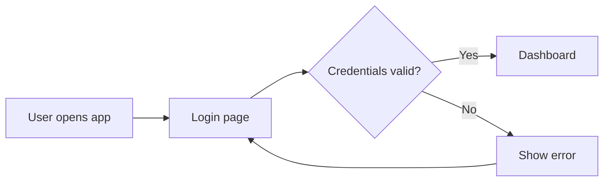

# Azure DevOps Wiki Variation: Flowchart Process

## Diagram



## Syntax

```md
::: mermaid
graph LR;
    User[User opens app] --> Login[Login page]
    Login --> Auth{Credentials valid?}
    Auth -->|Yes| Dashboard[Dashboard]
    Auth -->|No| Error[Show error]
    Error --> Login
:::
```

Notes:

- Use `graph`, not `flowchart`, in Azure DevOps wiki.
- Avoid unsupported long-arrow syntax and advanced flowchart features.
