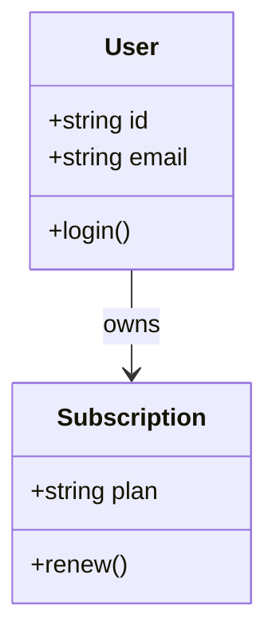

# Azure DevOps Wiki Variation: Class Domain Model

## Diagram



## Syntax

```md
::: mermaid
classDiagram
    class User {
        +string id
        +string email
        +login()
    }
    class Subscription {
        +string plan
        +renew()
    }
    User --> Subscription : owns
:::
```

Notes:

- Keep the diagram compact if the wiki page is narrow.
