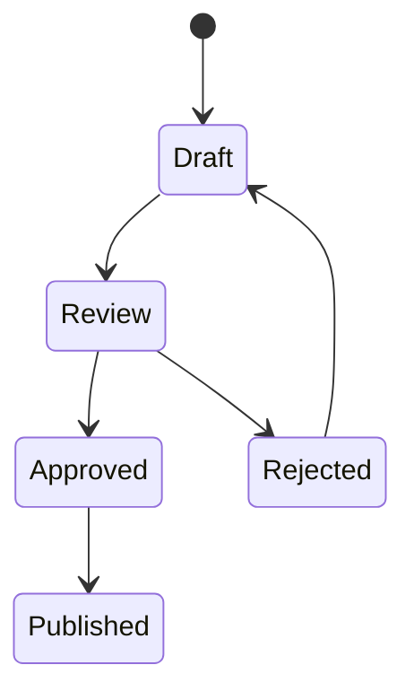

# Azure DevOps Wiki Variation: State Lifecycle

## Diagram



## Syntax

```md
::: mermaid
stateDiagram-v2
    [*] --> Draft
    Draft --> Review
    Review --> Approved
    Review --> Rejected
    Rejected --> Draft
    Approved --> Published
:::
```

Notes:

- Useful for work item, incident, and release state pages.
