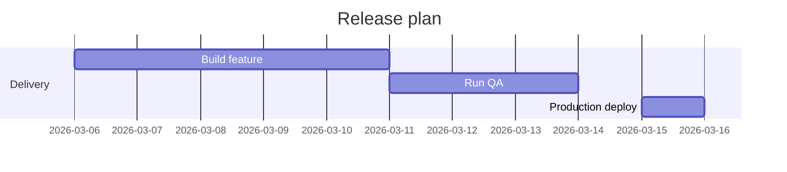

# Azure DevOps Wiki Variation: Gantt Release Plan

## Diagram



## Syntax

```md
::: mermaid
gantt
    title Release plan
    dateFormat YYYY-MM-DD
    section Delivery
    Build feature     :a1, 2026-03-06, 5d
    Run QA            :after a1, 3d
    Production deploy :2026-03-15, 1d
:::
```

Notes:

- Azure DevOps wiki explicitly documents Gantt support.
