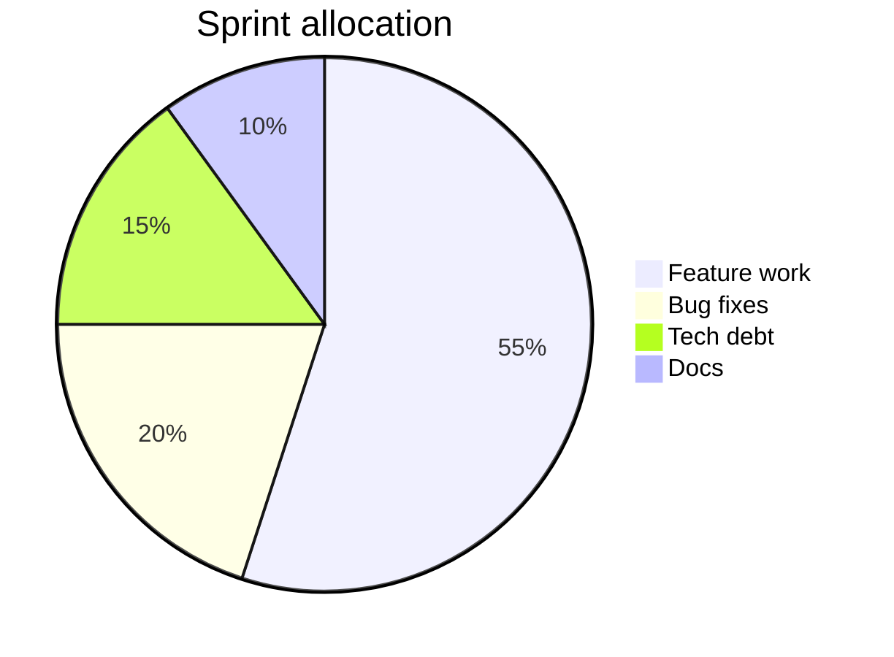

# Azure DevOps Wiki Variation: Pie Allocation

## Diagram



## Syntax

```md
::: mermaid
pie title Sprint allocation
    "Feature work" : 55
    "Bug fixes" : 20
    "Tech debt" : 15
    "Docs" : 10
:::
```

Notes:

- Keep labels short so the rendered chart stays readable.
