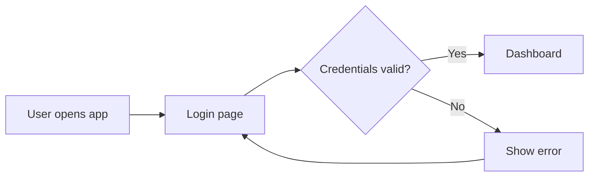

# Mermaid: Flowchart Process

## Diagram


```mermaid
flowchart LR
    User[User opens app] --> Login[Login page]
    Login --> Auth{Credentials valid?}
    Auth -->|Yes| Dashboard[Dashboard]
    Auth -->|No| Error[Show error]
    Error --> Login
```

## Syntax

````md

```mermaid
flowchart LR
    User[User opens app] --> Login[Login page]
    Login --> Auth{Credentials valid?}
    Auth -->|Yes| Dashboard[Dashboard]
    Auth -->|No| Error[Show error]
    Error --> Login
```
````

Notes:

- Use for decision paths and request flows.
- Outside Azure DevOps wiki, `flowchart` is clearer than `graph`.
