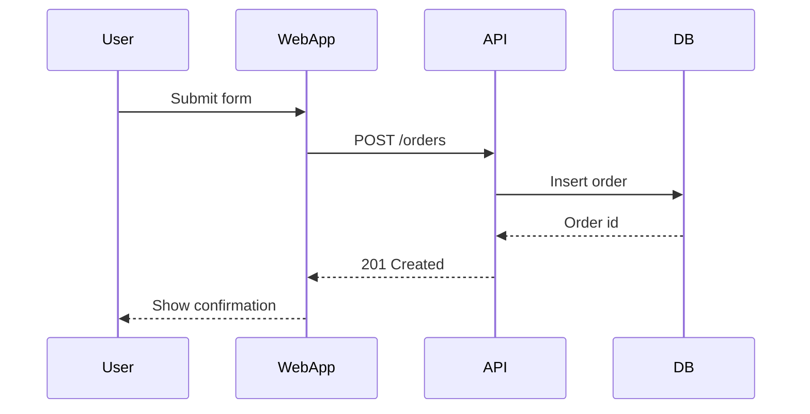

# Mermaid: Sequence API Call

## Diagram


```mermaid
sequenceDiagram
    participant User
    participant WebApp
    participant API
    participant DB

    User->>WebApp: Submit form
    WebApp->>API: POST /orders
    API->>DB: Insert order
    DB-->>API: Order id
    API-->>WebApp: 201 Created
    WebApp-->>User: Show confirmation
```

## Syntax

````md

```mermaid
sequenceDiagram
    participant User
    participant WebApp
    participant API
    participant DB

    User->>WebApp: Submit form
    WebApp->>API: POST /orders
    API->>DB: Insert order
    DB-->>API: Order id
    API-->>WebApp: 201 Created
    WebApp-->>User: Show confirmation
```
````

Notes:

- Use for request lifecycles, auth handshakes, and service interactions.
