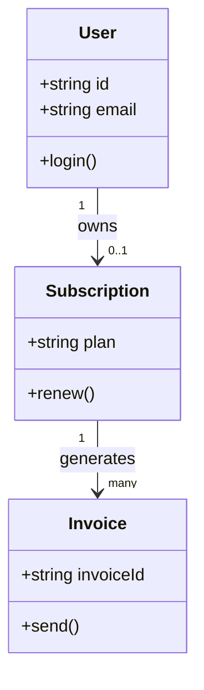

# Mermaid: Class Domain Model

## Diagram


```mermaid
classDiagram
    class User {
        +string id
        +string email
        +login()
    }
    class Subscription {
        +string plan
        +renew()
    }
    class Invoice {
        +string invoiceId
        +send()
    }

    User "1" --> "0..1" Subscription : owns
    Subscription "1" --> "many" Invoice : generates
```

## Syntax

````md

```mermaid
classDiagram
    class User {
        +string id
        +string email
        +login()
    }
    class Subscription {
        +string plan
        +renew()
    }
    class Invoice {
        +string invoiceId
        +send()
    }

    User "1" --> "0..1" Subscription : owns
    Subscription "1" --> "many" Invoice : generates
```
````

Notes:

- Use for domain objects, SDKs, and service model docs.
