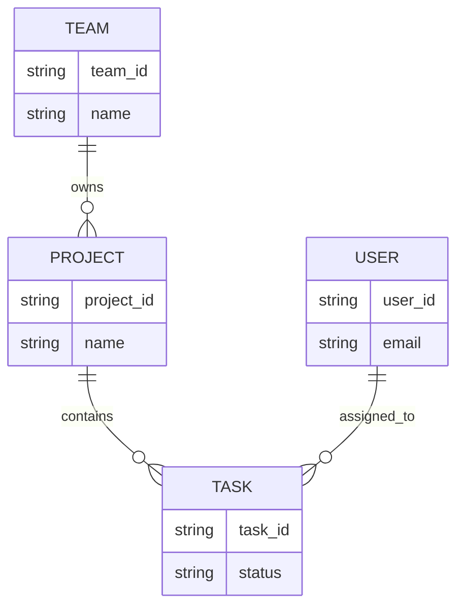

# Mermaid: ER Data Model

## Diagram


```mermaid
erDiagram
    TEAM ||--o{ PROJECT : owns
    PROJECT ||--o{ TASK : contains
    USER ||--o{ TASK : assigned_to

    TEAM {
        string team_id
        string name
    }
    PROJECT {
        string project_id
        string name
    }
    TASK {
        string task_id
        string status
    }
    USER {
        string user_id
        string email
    }
```

## Syntax

````md

```mermaid
erDiagram
    TEAM ||--o{ PROJECT : owns
    PROJECT ||--o{ TASK : contains
    USER ||--o{ TASK : assigned_to

    TEAM {
        string team_id
        string name
    }
    PROJECT {
        string project_id
        string name
    }
    TASK {
        string task_id
        string status
    }
    USER {
        string user_id
        string email
    }
```
````

Notes:

- Use for schema overviews and storage design docs.
