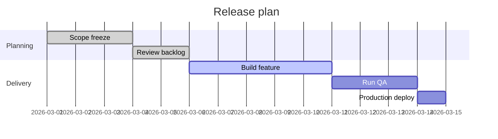

# Mermaid: Gantt Release Plan

## Diagram


```mermaid
gantt
    title Release plan
    dateFormat YYYY-MM-DD

    section Planning
    Scope freeze      :done, p1, 2026-03-01, 3d
    Review backlog    :done, p2, after p1, 2d

    section Delivery
    Build feature     :active, d1, 2026-03-06, 5d
    Run QA            :d2, after d1, 3d
    Production deploy :d3, after d2, 1d
```

## Syntax

````md

```mermaid
gantt
    title Release plan
    dateFormat YYYY-MM-DD

    section Planning
    Scope freeze      :done, p1, 2026-03-01, 3d
    Review backlog    :done, p2, after p1, 2d

    section Delivery
    Build feature     :active, d1, 2026-03-06, 5d
    Run QA            :d2, after d1, 3d
    Production deploy :d3, after d2, 1d
```
````

Notes:

- Use for release calendars and implementation plans.
