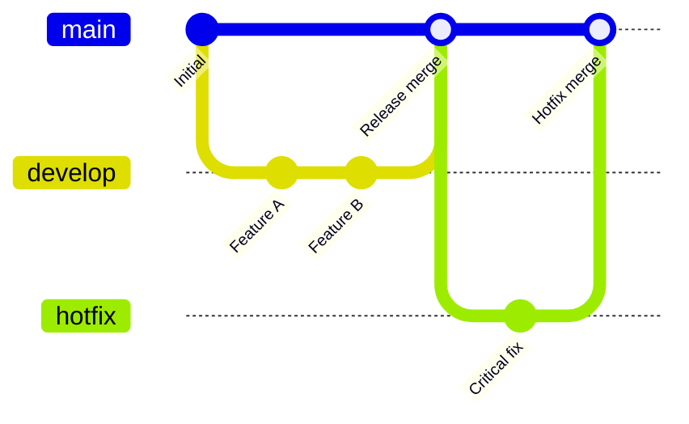

# Mermaid: GitGraph Release Flow

````md

```mermaid
gitGraph
    commit id: "Initial"
    branch develop
    checkout develop
    commit id: "Feature A"
    commit id: "Feature B"
    checkout main
    merge develop id: "Release merge"
    branch hotfix
    checkout hotfix
    commit id: "Critical fix"
    checkout main
    merge hotfix id: "Hotfix merge"
```
````

Notes:

- Use for branching strategy and release management docs.
