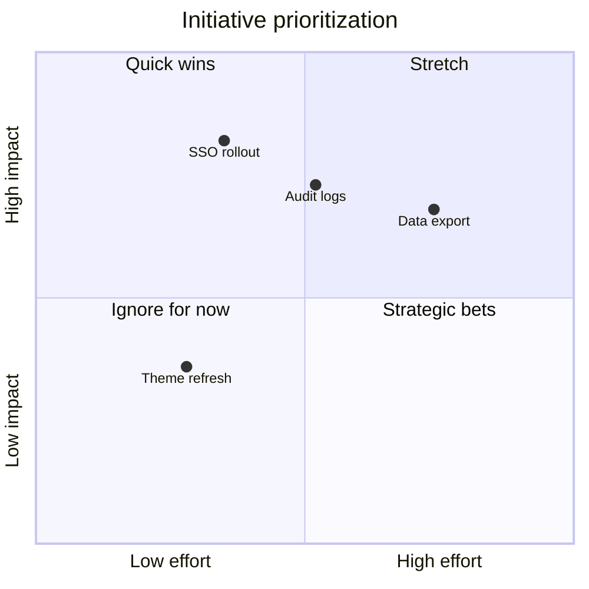

# Mermaid: Quadrant Prioritization

## Diagram


```mermaid
quadrantChart
    title Initiative prioritization
    x-axis Low effort --> High effort
    y-axis Low impact --> High impact
    quadrant-1 Stretch
    quadrant-2 Quick wins
    quadrant-3 Ignore for now
    quadrant-4 Strategic bets
    SSO rollout: [0.35, 0.82]
    Audit logs: [0.52, 0.73]
    Theme refresh: [0.28, 0.36]
    Data export: [0.74, 0.68]
```

## Syntax

````md

```mermaid
quadrantChart
    title Initiative prioritization
    x-axis Low effort --> High effort
    y-axis Low impact --> High impact
    quadrant-1 Stretch
    quadrant-2 Quick wins
    quadrant-3 Ignore for now
    quadrant-4 Strategic bets
    SSO rollout: [0.35, 0.82]
    Audit logs: [0.52, 0.73]
    Theme refresh: [0.28, 0.36]
    Data export: [0.74, 0.68]
```
````

Notes:

- Use for prioritization and portfolio planning.
