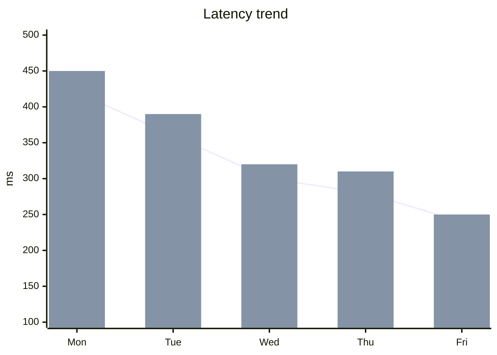

# Mermaid: XY Chart Metrics

````md

```mermaid
xychart-beta
    title "Latency trend"
    x-axis [Mon, Tue, Wed, Thu, Fri]
    y-axis "ms" 100 --> 500
    line [420, 360, 300, 280, 240]
    bar [450, 390, 320, 310, 250]
```
````

Notes:

- Use for trend lines, throughput, and response time metrics.
- This chart type can be beta depending on Mermaid version.
