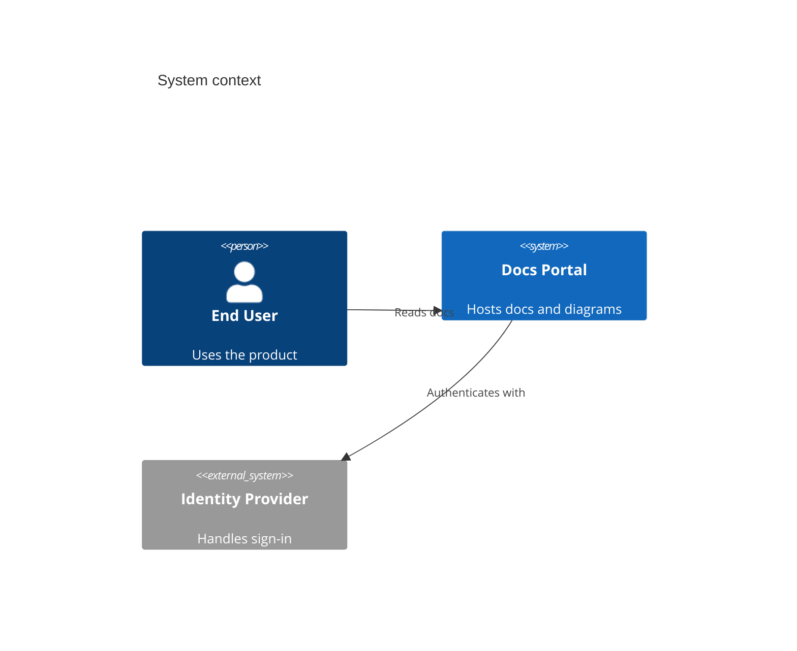

# Mermaid: C4 Diagrams

````md

````

Notes:

- Use `C4Context` for system context, `C4Container` for deployable parts, `C4Component` for internals, `C4Dynamic` for interactions, and `C4Deployment` for runtime topology.
- C4 support is experimental and depends on Mermaid renderer version.
