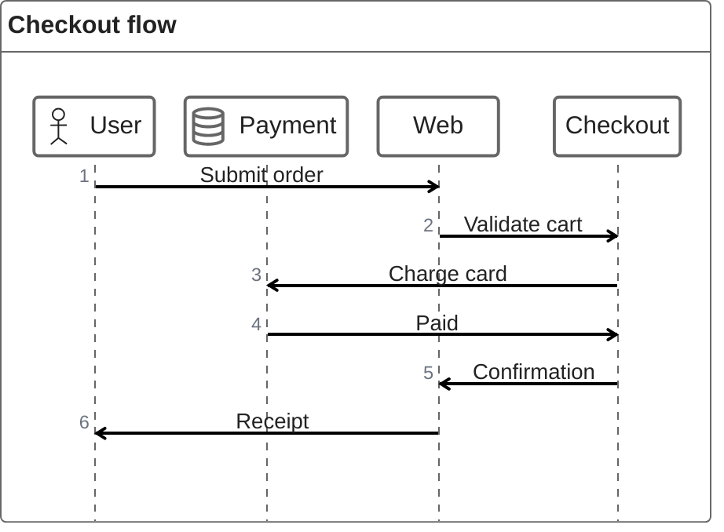

# Mermaid: ZenUML Service Flow

## Diagram


```mermaid
zenuml
    title Checkout flow
    @Actor User
    @Database Payment
    Web
    Checkout

    User->Web: Submit order
    Web->Checkout: Validate cart
    Checkout->Payment: Charge card
    Payment->Checkout: Paid
    Checkout->Web: Confirmation
    Web->User: Receipt
```

## Syntax

````md

```mermaid
zenuml
    title Checkout flow
    @Actor User
    @Database Payment
    Web
    Checkout

    User->Web: Submit order
    Web->Checkout: Validate cart
    Checkout->Payment: Charge card
    Payment->Checkout: Paid
    Checkout->Web: Confirmation
    Web->User: Receipt
```
````

Notes:

- Use for code-like interaction flows when teams prefer ZenUML syntax.
