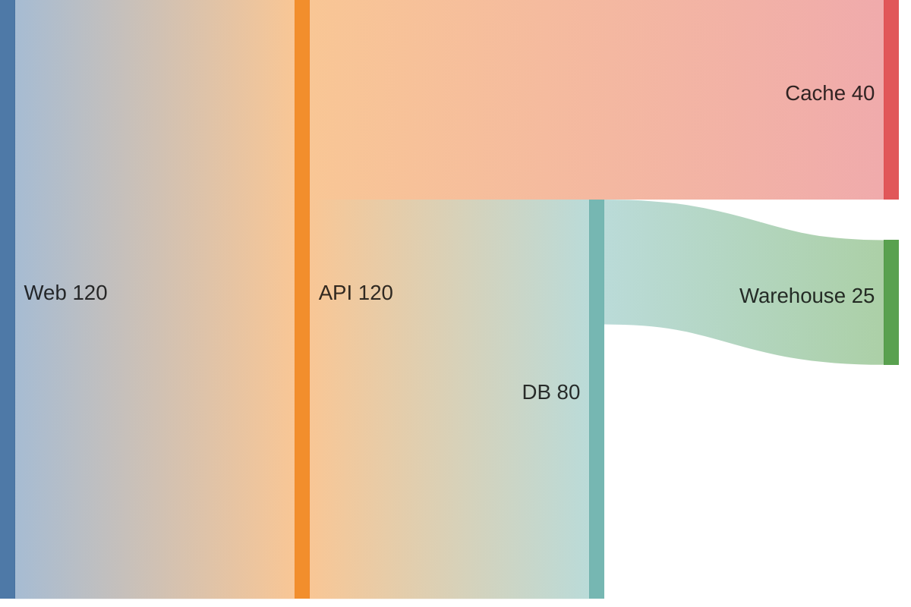

# Mermaid: Sankey Traffic Flow

````md

```mermaid
sankey

    Web,API,120
    API,Cache,40
    API,DB,80
    DB,Warehouse,25
```
````

Notes:

- Use for traffic, cost, or data movement summaries.
- Mermaid documents Sankey as experimental even though the keyword is `sankey`.
