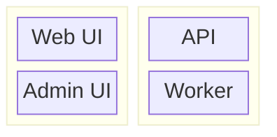

# Mermaid: Block Deployment Layout

````md

````

Notes:

- Use for layered deployment layouts and simple component groupings.
- Block diagrams use the `block` keyword and more manual layout control.
