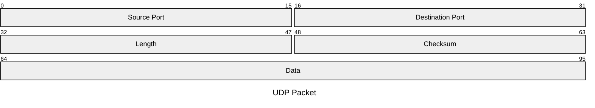

# Mermaid: Packet Network

## Diagram


```mermaid
packet
    title UDP Packet
    +16: "Source Port"
    +16: "Destination Port"
    32-47: "Length"
    48-63: "Checksum"
    64-95: "Data"
```

## Syntax

````md

```mermaid
packet
    title UDP Packet
    +16: "Source Port"
    +16: "Destination Port"
    32-47: "Length"
    48-63: "Checksum"
    64-95: "Data"
```
````

Notes:

- Use for network packet or binary layout documentation.
- Mermaid documents packet diagrams with the `packet` keyword.
