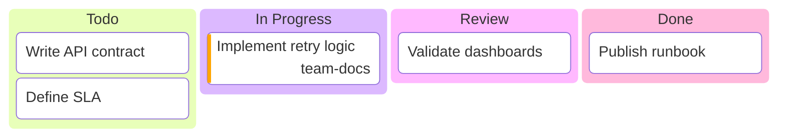

# Mermaid: Kanban Workflow

````md

```mermaid
kanban
        todo[Todo]
            doc1[Write API contract]
            doc2[Define SLA]
        doing[In Progress]
            task1[Implement retry logic]@{ assigned: "team-docs", priority: "High" }
        review[Review]
            review1[Validate dashboards]
        done[Done]
            done1[Publish runbook]
```
````

Notes:

- Use for lightweight workflow snapshots and team status docs.
- Mermaid Kanban needs explicit columns with indented task items.
