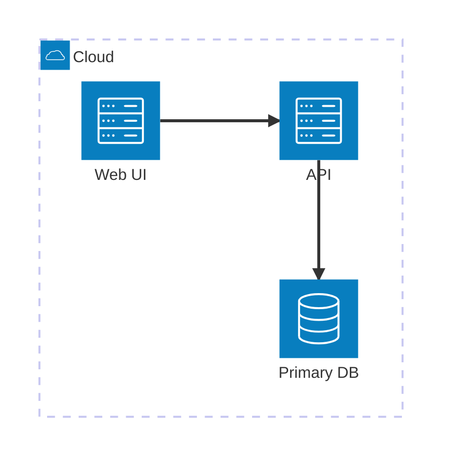

# Mermaid: Architecture Platform

````md

```mermaid
architecture-beta
    group cloud(cloud)[Cloud]
    service ui(server)[Web UI] in cloud
    service api(server)[API] in cloud
    service db(database)[Primary DB] in cloud
    ui:R --> L:api
    api:B --> T:db
```
````

Notes:

- Use for deployment topology and platform architecture views.
- This diagram type can be beta depending on Mermaid version.
