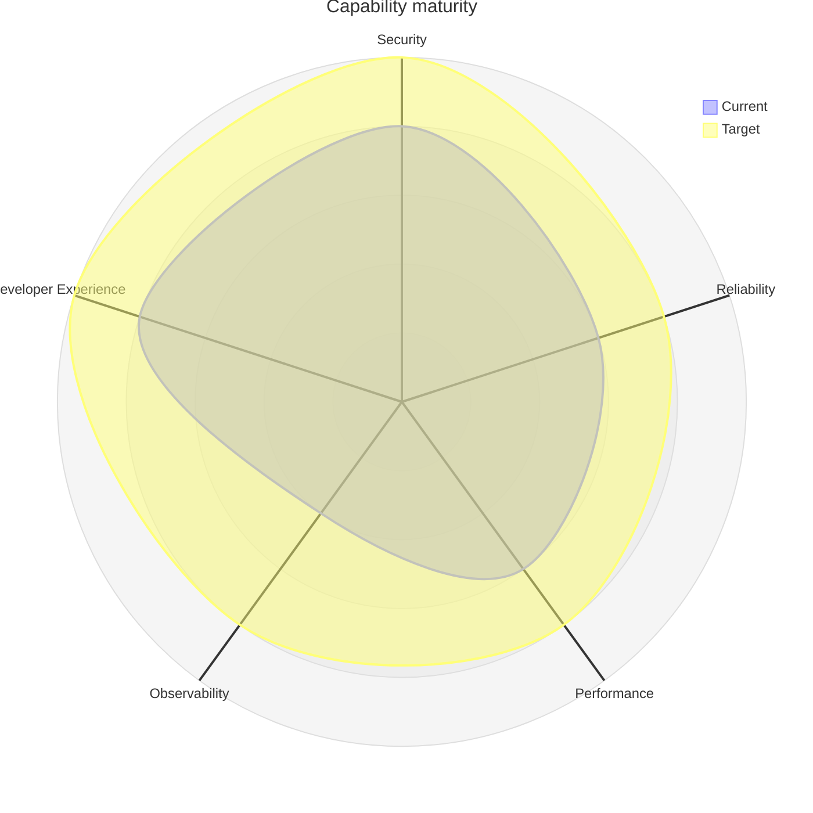

# Mermaid: Radar Capability Maturity

````md

```mermaid
radar-beta
    title Capability maturity
    axis sec["Security"], rel["Reliability"], perf["Performance"]
    axis obs["Observability"], dx["Developer Experience"]
    curve current["Current"]{4, 3, 3, 2, 4}
    curve target["Target"]{5, 4, 4, 4, 5}
    max 5
```
````

Notes:

- Use for maturity models and capability comparisons.
- This chart type can be beta depending on Mermaid version.
